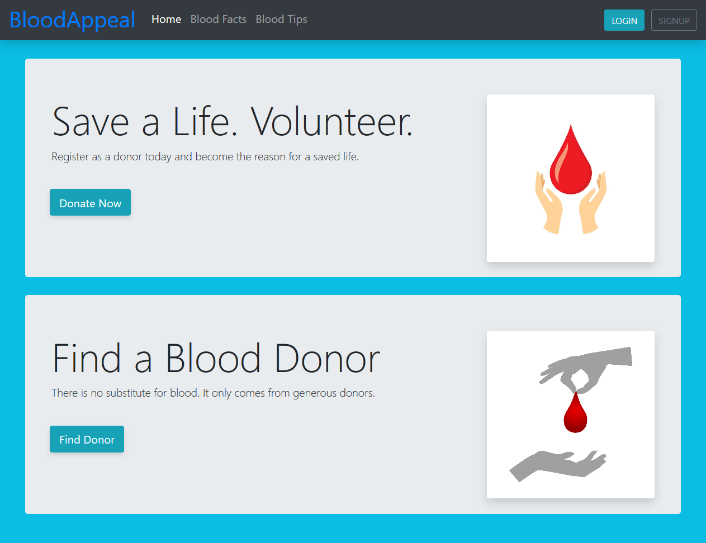

# BloodAppeal

BloodAppeal is a Bootstrap 4 Template for Blood Bank Applications

  

## Installation

Let's make it easy! Just download this template, use it on your project.

## Tech Stack

- HTML
- CSS
- Bootstrap

## Demo

- [Home](https://bloodappeal.surge.sh/)
- [Blood Facts](https://bloodappeal.surge.sh/pages/blood-facts.html)
- [Blood Tips](https://bloodappeal.surge.sh/pages/blood-tips.html)

## License

This is an open source Template [licensed as MIT](https://github.com/safdarjamal/bloodappeal/blob/master/LICENSE).
